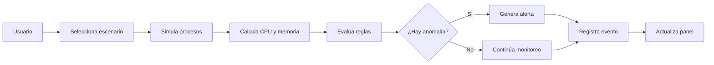
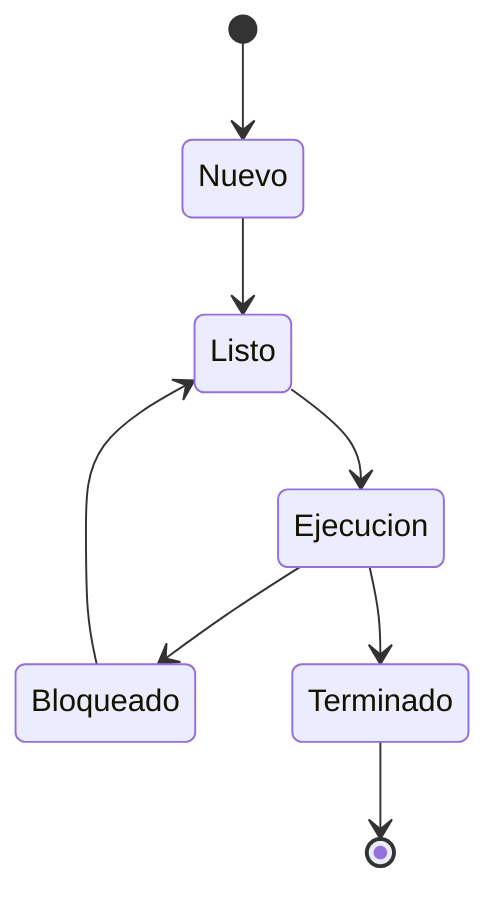

# Diagrama de funcionamiento

```mermaid
flowchart LR
    A[Usuario] --> B[Selecciona escenario]
    B --> C[Simula procesos]
    C --> D[Calcula CPU y memoria]
    D --> E[Evalúa reglas]
    E --> F{¿Hay anomalía?}
    F -- Sí --> G[Genera alerta]
    F -- No --> H[Continúa monitoreo]
    G --> I[Registra evento]
    H --> I
    I --> J[Actualiza panel]
```

## Ciclo de vida simulado

```mermaid
stateDiagram-v2
    [*] --> Nuevo
    Nuevo --> Listo
    Listo --> Ejecucion
    Ejecucion --> Bloqueado
    Bloqueado --> Listo
    Ejecucion --> Terminado
    Terminado --> [*]
```
