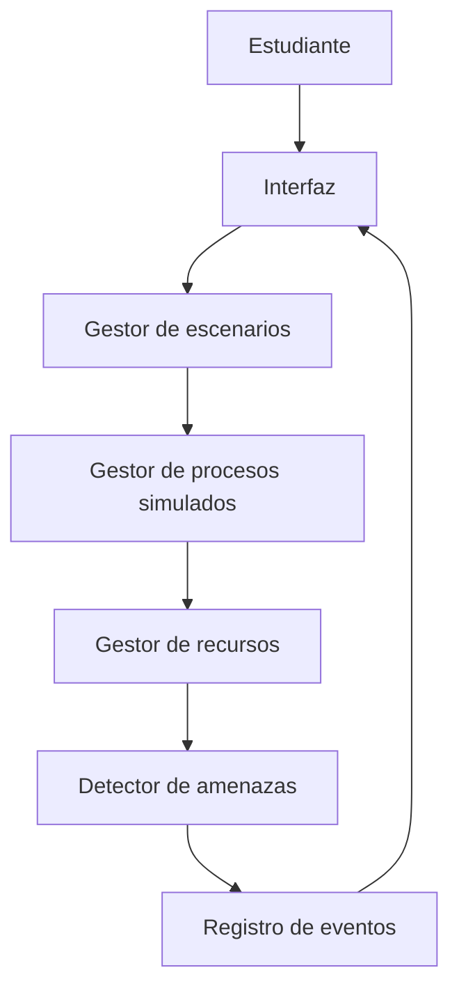

# Diagrama de arquitectura

```mermaid
flowchart TB
U[Estudiante] --> UI[Interfaz]
UI --> ES[Gestor de escenarios]
ES --> GP[Gestor de procesos simulados]
GP --> GR[Gestor de recursos]
GR --> DT[Detector de amenazas]
DT --> RE[Registro de eventos]
RE --> UI
```
